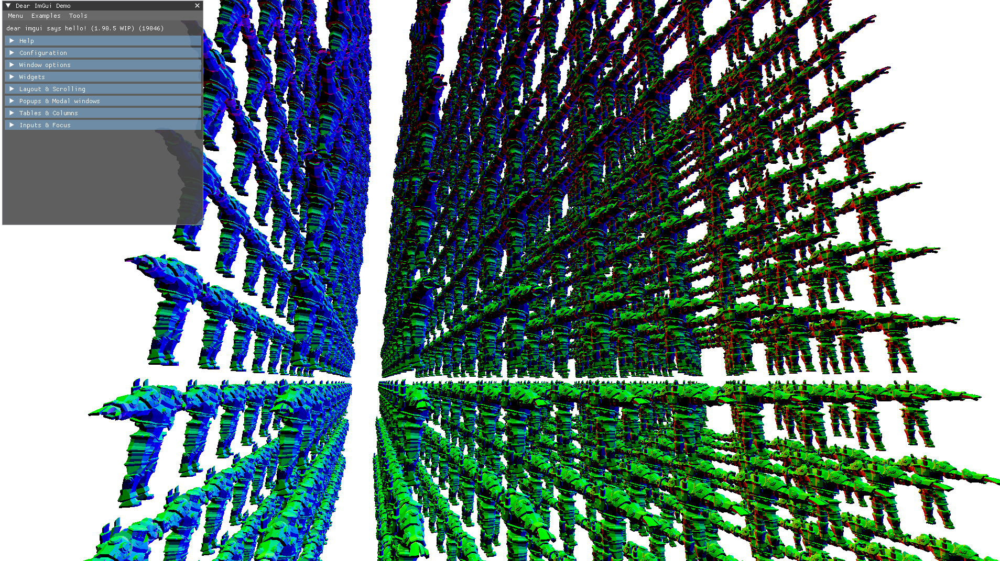

# Husky Game Engine

Another attempt at a game engine, seeking to apply what I have learned about software development in my first two years at Northeastern University.

### Write Games, Not Engines

> Write Games, Not Engines

My goal with this project is to eventually be able to create commercial games with this engine. However, it is important to focus on writing _games_, so that is what I will do. That said, there is a lot of scaffolding that must be done first and preferrably not redone every time. As such it makes sense to structure this as a game engine and implement features as necessary.

### Roadmap

1. Complete the initial scaffolding, that is, implement all the minimal features I would need to make _any_ game.
2. Create multiplayer pong
3. Create multiplayer platformer.
4. Create basic 3D multiplayer games.
5. ...

### Installing

Currently I have only tested this on Windows devices. Although all APIs and libraries are cross-platform, platform and compiler quirks may mean it does not work on Max/Linux. Additionally it requires OpenGL 4.5, which most devices should support.

1. Install [GNU Coreutils](https://gnuwin32.sourceforge.net/packages/coreutils.htm) (if on windows).
2. Install [Python](https://www.python.org/).
3. Install [MinGW-w64](https://www.mingw-w64.org/) (if on windows).
4. Install [CMake](https://cmake.org/download/).
5. Clone the repository.
6. In the root directory enter the command `python install.py && python build.py --run`
